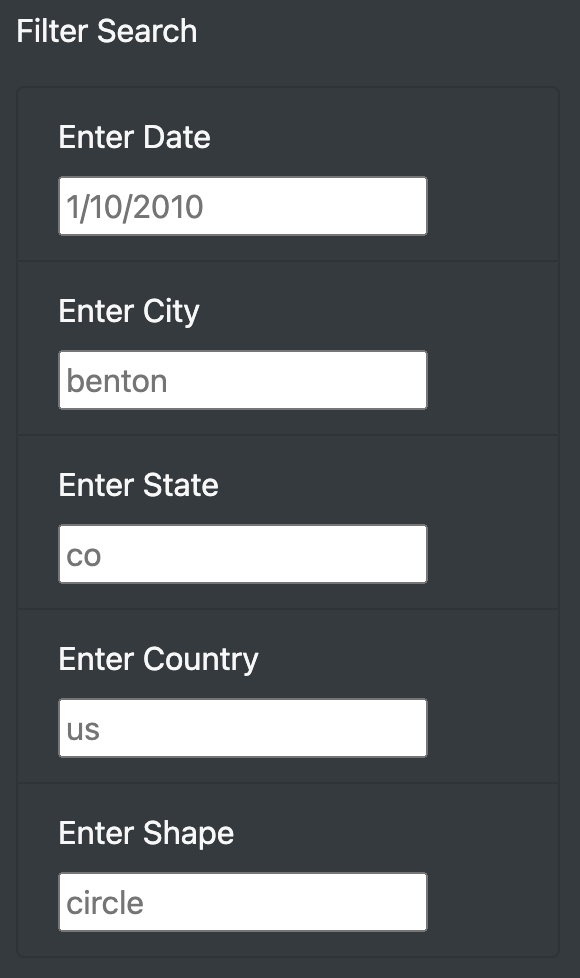

# UFOs

## Overview of Project
The primary purpose of this analysis was to create a table to organize data on UFO sightings that is stored as a JavaScript array, or list. This table was then displayed on a webpage and equiped with filters, allowing the user to filter on several different elements and interact with the data. 

## Results
To filter the data you simply need to enter a date, city, state, country or shape below where it says "Filter Search". The one caveat is that you must enter each search parameter in the exact format as the placeholder in the input box displays. For example, when searching for countries, you must enter "us" because entering "US" or "United States" will return nothing. A photo of these input boxes and the format each entered value needs to follow can be seen below.

## Summary 
One drawback of this design is that you can only filter the data on one date at a time. It would be more useful if you could search for a range of dates and pull up the data for an entire year's worth of UFO sightings in Colorado for example. Probably the biggest drawback is that the input boxes are case sensitive. This means that if a user searches the state of Colorado with a capital "CO", they will not get a result. However, if they search for Colorado with a lowercase "co", they will see several results. It would be much more user friendly if you could search "Colorado", "colorado", "CO", or even just "co " with a space after it and get the same results.
